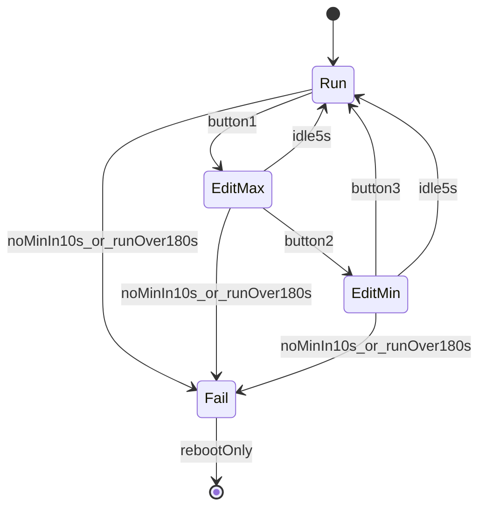

<!-- 2ce4f129-94b5-4c7a-a14c-da3e7e0042ff -->
---
todos:
  - id: "deps-pins"
    content: "Add ST7789/GFX libs to platformio.ini and create pins.h with GPIO map"
    status: pending
  - id: "settings"
    content: "Implement Preferences load/save for min/max with defaults and clamp rules"
    status: pending
  - id: "encoder"
    content: "Implement encoder A/B + button debounce and 0.001 MPa step editing"
    status: pending
  - id: "control"
    content: "Pressure ADC + pump hysteresis; fail if min not reached in 10s or run >180s"
    status: pending
  - id: "display"
    content: "ST7789 UI: P, min, max, pump state, edit highlight, FAIL screen"
    status: pending
  - id: "main-fsm"
    content: "Run/EditMax/EditMin/Fail FSM; 3rd button or 5s idle; lock until reboot on Fail"
    status: pending
isProject: false
---
# Water Pump Pressure Controller

## Hardware mapping

| Function | GPIO |
|----------|------|
| Pressure sensor (ADC) | 0 (A0) |
| Encoder A | 1 |
| Encoder button | 8 |
| Pump relay/control | 9 |
| Encoder B | 10 |
| ST7789 MOSI (SDA) | 6 |
| ST7789 SCLK (SCL) | 4 |
| ST7789 CS | 7 |
| ST7789 DC | 5 |
| ST7789 RST | 3 |

No backlight pin (always on with power). Display assumed **240×240** ST7789 (SPI). Pins live in one header so they are easy to retune if your wiring differs.

## Behavior

- **Run mode:** read pressure; if `pressure < min` → pump ON; if `pressure >= max` → pump OFF (hysteresis band between min and max).
- **Button cycle:** 1st press → Edit max; 2nd press → Edit min; **3rd press → Run (normal mode)**.
- **Edit max / edit min:** rotate encoder ±0.001 MPa per detent; clamp to sensor range **0.100–0.500 MPa** and keep `min < max`.
- **Idle exit:** 5 s without button press → save if changed → return to Run. Encoder rotation does **not** extend that timer; a button that stays in edit (1st→2nd) resets the 5 s window.
- On leaving edit (3rd button or timeout): write min/max to EEPROM (ESP32 `Preferences`/NVS). Load on boot; if missing, defaults e.g. min `0.200`, max `0.350` MPa.

### Fail-safe (latched until reboot)

When the pump turns **ON**, start two watches:

1. **Prime / reach-min timeout (10 s):** if pressure has not reached **min** within 10 s of pump start → enter **Fail**.
2. **Max continuous run (180 s):** if the pump stays ON longer than 180 s (regardless of pressure) → enter **Fail**.

On **Fail**:

- Switch pump **OFF** immediately.
- Ignore encoder and button (no edit, no control changes).
- Show **FAIL** on the LCD (with current pressure if useful).
- Stay in Fail until **power cycle / reboot** (no soft clear).

Cancel/reset the 10 s and 180 s timers when the pump turns OFF normally (pressure reached max). The 10 s “reach min” check only applies from each pump-ON edge until pressure first hits min or Fail triggers.

## Pressure conversion

Linear map from 12-bit ADC:

- ADC max (`4095`) → **0.500 MPa**
- ADC corresponding to atmospheric → **0.100 MPa** (treat ADC `0` as 0.100 MPa unless you later add a calibration offset)

\[
P = 0.1 + (ADC / 4095) \times 0.4
\]

## Software structure

Replace the blink sketch; keep Arduino + PlatformIO on `esp32-c3-devkitc-02`.

- [`platformio.ini`](platformio.ini) — add `Adafruit GFX`, `Adafruit ST7789`, `Adafruit BusIO`.
- [`include/pins.h`](include/pins.h) — all GPIOs and display size.
- [`include/settings.h`](include/settings.h) / [`src/settings.cpp`](src/settings.cpp) — load/save min/max via `Preferences`.
- [`src/encoder.cpp`](src/encoder.cpp) — quadrature + debounced button; returns delta and press events.
- [`src/display.cpp`](src/display.cpp) — ST7789 UI: current P, min, max, pump ON/OFF; highlight the field being edited.
- [`src/main.cpp`](src/main.cpp) — setup, control loop, mode machine, edit timeout, fail latch.

## UI (simple full-screen layout)

- Title / mode line (`RUN` / `EDIT MAX` / `EDIT MIN` / `FAIL`)
- Current pressure (large), units MPa
- Min and Max lines
- Pump state (`ON` / `OFF`), color-coded if practical
- In Fail: prominent `FAIL` message; controls inactive

## Control loop notes

- Sample ADC with light averaging to reduce flicker.
- Drive pump pin as digital output (HIGH = ON); assume active-high relay/module.
- Track `pumpOnSince` for the 180 s cap; track `awaitingMinSince` until pressure >= min after each pump start for the 10 s fail.
- Fail checks run even while in edit modes (safety overrides UI).
- Do not block on display redraws longer than needed; update LCD when values/mode change (or ~5–10 Hz).
