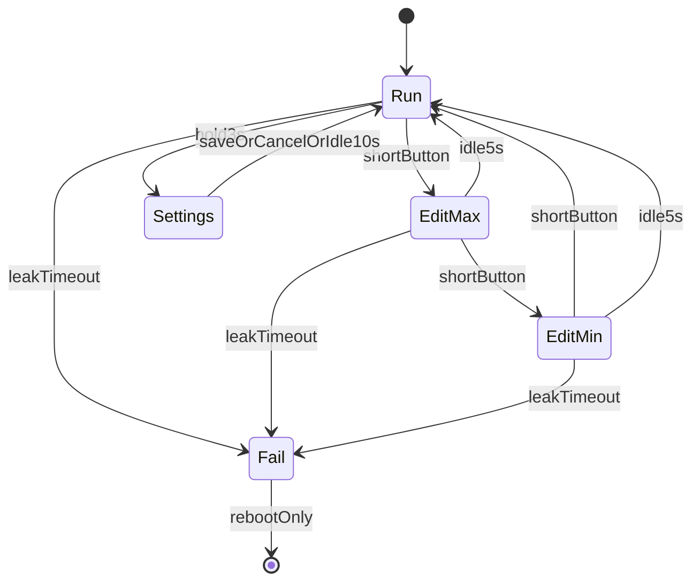

<!-- 2ce4f129-94b5-4c7a-a14c-da3e7e0042ff -->
---
todos:
  - id: "deps-pins"
    content: "Add ST7789/GFX libs to platformio.ini and create pins.h with GPIO map"
    status: completed
  - id: "settings"
    content: "Implement Preferences load/save for min/max/LEAK/WEAK/SENS with defaults and clamp rules"
    status: completed
  - id: "encoder"
    content: "Implement encoder A/B + button debounce and 0.001 MPa step editing"
    status: completed
  - id: "control"
    content: "Pressure ADC + pump hysteresis; Fail on LEAK; WEAK turns pump OFF only"
    status: completed
  - id: "display"
    content: "ST7789 UI: P, min, max, pump icon, edit highlight, FAIL/SETTINGS screens"
    status: completed
  - id: "main-fsm"
    content: "Run/EditMax/EditMin/Settings/Fail FSM; idle timeouts; Fail locks until reboot"
    status: completed
isProject: false
---
# Water Pump Pressure Controller

Prefer [`HANDOFF.md`](HANDOFF.md) as the live truth; this plan tracks the intended/completed feature set.

## Hardware mapping

| Function | GPIO |
|----------|------|
| Pressure sensor (ADC) | 0 |
| Encoder A | 10 |
| Encoder B | 1 |
| Encoder button | 8 |
| Pump relay/control | 9 |
| ST7789 MOSI (SDA) | 6 |
| ST7789 SCLK (SCL) | 4 |
| ST7789 CS | 7 |
| ST7789 DC | 2 |
| ST7789 RST | 3 |

No backlight pin (always on with power). Display **240×320** ST7789 (SPI), rotation 180°. Pins in [`include/pins.h`](../include/pins.h).

## Behavior

- **Run mode:** if `pressure < min` → pump ON; if `pressure >= max` → pump OFF (hysteresis).
- **Button cycle:** short press → Edit max → Edit min → Run.
- **Edit max / edit min:** rotate ±0.001 MPa; clamp with `min < max` against sensor range; idle **5 s** without button **or rotation** → save if dirty → Run.
- **SETTINGS:** hold ≥ 3 s; rows LEAK / WEAK / SENS / SAVE / CANCEL; idle 10 s cancels.
- Persist min/max and advanced settings via ESP32 `Preferences`/NVS.

### Pump watches (after each pump ON)

1. **LEAK** (`leakDetectSec`, default 10 s): pressure not yet at **min** → **Fail** (pump OFF, latch until reboot).
2. **WEAK** (`pumpWeakSec`, default 180 s): continuous ON too long → **pump OFF only** (no Fail). May restart on next loop if still below min.

On **Fail**:

- Pump OFF immediately.
- Ignore encoder/button for control.
- Show FAIL screen; stay until power cycle.

## Pressure conversion

- ADC **0** → **-1** (vacuum / 0 psi display path).
- ADC **4095** → `sensorMaxMpa` (default 0.5 MPa = 5 Atm; editable as SENS).
- UI shows atmospheres: `mpa / 0.1`.

## Software structure

Arduino + PlatformIO on `esp32-c3-devkitc-02` at  
`/home/dsporynkhin/Projects/cpp/home/presure-controller`.

- [`platformio.ini`](../platformio.ini) — Adafruit GFX / ST7789 / BusIO.
- [`include/pins.h`](../include/pins.h) — GPIOs and display size.
- [`include/settings.h`](../include/settings.h) / [`src/settings.cpp`](../src/settings.cpp) — NVS load/save.
- [`src/encoder.cpp`](../src/encoder.cpp) — quadrature + short / 1 s / 3 s hold.
- [`src/display.cpp`](../src/display.cpp) — ST7789 bands + pump icon + SETTINGS/FAIL.
- [`src/main.cpp`](../src/main.cpp) — FSM, control, timeouts.

## UI (main screen)

Top → bottom bands: **MAX** → **Current** (centered) → **Pump icon** (green ON / gray OFF) → **MIN**.  
Edit highlight: black on yellow. Fail: FAIL + pressure + Reboot hint.

## Control loop notes

- Sample ADC with light averaging.
- Pump pin HIGH = ON (active-high).
- Track `pumpOnSince` for WEAK; `awaitingMinSince` for LEAK until pressure ≥ min.
- Safety checks run in edit modes too (SETTINGS pauses control).
- Partial LCD redraws on change (~display period in main).
